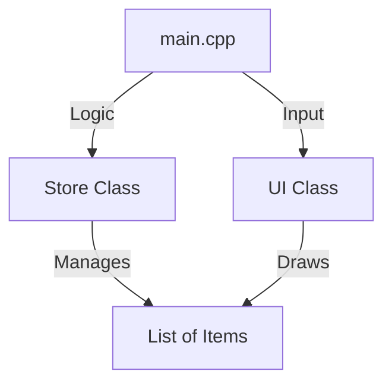

# Design Document: Alfamart Store TUI

## Introduction
I built this Alfamart Store TUI to simulate a simple shop. I wanted to make something that works well but is also easy for the team to read and learn from.

## Project Architecture
I split the code into four main parts so it wouldn't be one huge file:

1.  **`Store` (The Logic)**: This handles the math, inventory, and cart.
2.  **`UI` (The Display)**: This draws everything on the screen.
3.  **`Item` (The Data)**: Just holds the product info.
4.  **`main` (The Controller)**: Connects the inputs to the logic.

Here's how they connect:

## Component Breakdown

### 1. Item (`Item.h`)
This is just a `struct` to hold our product data: Name, Price, Stock, and Cart Quantity.

### 2. Store (`Store.h` / `Store.cpp`)
This class does the heavy lifting. It keeps the list of items, adds things to your cart, and calculates the totals (including the 12% VAT).

### 3. UI (`UI.h` / `UI.cpp`)
I kept the drawing code separate here. It handles the splash screen, the receipt formatting, and clearing the console.

### 4. Main (`main.cpp`)
The entry point. It loops through the game states (Start, Store, Admin) and tells the `Store` and `UI` what to do based on your key presses.

## Design Decisions

### Why I used `std::vector` instead of Arrays
Standard C++ uses fixed-size arrays (like `int arr[10]`). I chose `std::vector` because:
- **It's Flexible**: We can add more items later without changing a "size" constant.
- **It's Safer**: It knows its own size, so we don't accidentally go out of bounds.

### Why I used `conio.h` for Input
You might notice I used `_getch()`.
- **Standard `cin`**: Requires you to press ENTER after every type. This feels clunky for a game/app.
- **`_getch()`**: Captures the key immediately. This allowed me to make the WASD navigation feel responsive, like a real game.

### Why I separated `UI` and `Store`
I could have put everything in `main.cpp`, but that would get messy fast. By separating them:
- If we want to change how the receipt looks, we only touch `UI.cpp`.
- If we want to change the VAT rate, we only touch `Store.cpp`.
- It makes it easier for us to work on different files at the same time.
